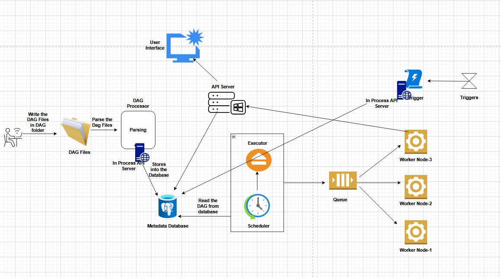

# Airflow Learning

This repository contains my learning setup for **Apache Airflow** using **Docker** and **uv (Python environment manager)**.  
The goal is to have a reproducible environment for experimenting with Airflow, running services locally.

---

## Architecture

Apache Airflow is a **workflow orchestration platform**. It allows defining tasks as Directed Acyclic Graphs (DAGs), managing their execution, and monitoring through a UI.

Below is a high-level architecture diagram of Airflow when running with Docker Compose:




Main components:
- **ApiServer**: Provides the Airflow UI.
- **Scheduler**: Orchestrates and schedules DAG tasks.
- **Workers**: Execute the tasks.
- **Metadata Database**: Stores DAGs, task states, and configurations.
- **Flower (optional)**: UI for monitoring Celery workers.

---

## Installation

### Prerequisites
- Install **Docker**: [Get Docker](https://www.docker.com/get-started/)  
- Install **uv**: [uv Documentation](https://docs.astral.sh/uv/)  

---

### Setup Steps

1. **Fetch Airflow Docker Compose file**  
   Download the official `docker-compose.yaml` provided by Airflow:  
   [Airflow Docker Compose Guide](https://airflow.apache.org/docs/apache-airflow/stable/howto/docker-compose/index.html#fetching-docker-compose-yaml)

2. **Install Python 3.11 using `uv`**  
   This will create a virtual environment (`.venv`) and install Python 3.11 inside it.
   ```bash
   uv venv --python 3.11

3. **Activate the virtual environment**
   ```bash
   uv venv --python 3.11
4. **Create the pyproject.toml file**
   ```ini
   [project]
   name = "airflow-learning"
   version = "0.1.0"
5. **Install the apache-airflow package**
      ```bash
   uv add apache-airflow==3.0.6
6. **Verify the installation**
      ```bash
   uv pip list
7. **Start the Airflow Services**
      ```bash
   docker compose up

>Once the services are up, you can access the UI on:
http://localhost:8080/

> The default username and password are both: airflow

> By default, the flower service will not be started. 
> It is linked with a Docker Compose profile. If you want the flower service to run as well, you can use the following command:

   ```bash
   docker compose --profile flower up
   ```

---